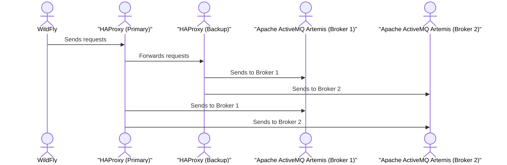

# Руководство по настройке высокодоступного кластера Apache ActiveMQ Artemis

## Содержание
- [Схема взаимодействия компонентов](#Схема-взаимодействия-компонентов)
- [Обзор](#обзор)
- [Изменения в конфигурации](#изменения-в-конфигурации)
- [Настройка HAProxy](#настройка-haproxy)
- [Настройка Keepalived](#настройка-keepalived)
- [Тестовые сценарии](#тестовые-сценарии)
- [Мониторинг и обслуживание](#мониторинг-и-обслуживание)
- [Устранение неисправностей](#устранение-неисправностей)

---
## Схема взаимодействия компонентов
## Описание компонентов:
**WildFly (Client/Producer):**

В этой архитектуре WildFly играет роль клиента или продюсера, который подключается к кластеру ActiveMQ Artemis через виртуальный IP (VIP). WildFly отправляет сообщения в очередь, используя протоколы JMS или другие, поддерживаемые ActiveMQ Artemis.
HAProxy (Primary & Backup):

**Основной HAProxy (Primary)**: Это балансировщик нагрузки, который принимает входящие соединения от клиентов и перенаправляет их на один из брокеров Artemis (в данном случае на Broker 1 или Broker 2). HAProxy балансирует трафик с использованием алгоритма source, что гарантирует, что соединение клиента будет направлено на тот же брокер на протяжении сессии.
**Резервный HAProxy (Backup)**: В случае сбоя основного HAProxy, резервный балансировщик автоматически перенаправит трафик с виртуального IP (VIP) на доступный брокер Artemis. Это управляется с помощью Keepalived, который контролирует состояние HAProxy.

**Keepalived:**

Keepalived следит за состоянием основных и резервных HAProxy, а также управляет виртуальным IP (VIP). В случае сбоя одного из балансировщиков (Primary HAProxy), VIP будет автоматически переключен на резервный (Backup HAProxy), обеспечивая отказоустойчивость.
Apache ActiveMQ Artemis (Broker 1 & Broker 2):

Broker 1 (например, 10.7.39.9) и Broker 2 (например, 10.7.39.12) — это два брокера в кластере ActiveMQ Artemis, которые работают в режиме active-active. Они обмениваются сообщениями и поддерживают согласованность данных между собой.
Каждый брокер слушает на порту 61616 (или другом, если настроено по-другому) и использует кластерное соединение для взаимодействия с другим брокером.
В случае сбоя одного из брокеров, другой продолжит обработку сообщений, обеспечивая высокую доступность.

**Поток данных:**
Клиент (например, WildFly) подключается к VIP (192.168.1.100), который указывает на один из HAProxy.
HAProxy (Primary) принимает запрос от клиента и перенаправляет его на один из брокеров ActiveMQ Artemis (например, Broker 1).
ActiveMQ Artemis (Broker 1) принимает сообщение и передает его в кластер, где оно может быть доступно и на Broker 2.

В случае сбоя HAProxy (Primary), Keepalived переключает VIP на HAProxy (Backup), который продолжит направлять трафик на доступный брокер.
HAProxy (Backup) принимает запросы и перенаправляет их на оставшийся работающий брокер.

В случае сбоя одного из брокеров ActiveMQ Artemis (например, Broker 1), сообщения автоматически обрабатываются другим брокером Broker 2, благодаря кластеризации.

## Преимущества:
Высокая доступность: Keepalived обеспечивает переключение VIP на резервный HAProxy, если основной балансировщик выходит из строя.
Нагрузочное распределение: HAProxy балансирует нагрузку между брокерами Artemis, улучшая производительность системы.
Отказоустойчивость: Кластеры брокеров ActiveMQ Artemis обеспечивают автоматический failover, если один из брокеров выходит из строя.

Схема взаимодействия компонентов



- **A (WildFly)** — это клиент или продюсер, который подключается к балансировщику HAProxy.
- **B (Primary HAProxy)** — основной балансировщик, который направляет запросы на брокеры ActiveMQ Artemis.
- **C (Backup HAProxy)** — резервный балансировщик, который берет на себя трафик в случае сбоя основного.
- **D (Broker 1) и E (Broker 2)** — два брокера ActiveMQ Artemis, которые обрабатывают сообщения.
## Обзор

Это руководство описывает процесс настройки высокодоступного кластера Apache ActiveMQ Artemis. Кластер состоит из следующих компонентов:

### Компоненты
- **2 узла Apache ActiveMQ Artemis** в режиме active-active
- **2 узла HAProxy** для балансировки нагрузки
- **Keepalived** для обеспечения отказоустойчивости HAProxy

### Топология сети
- **Artemis Node 1**: `10.7.39.9`
- **Artemis Node 2**: `10.7.39.12`
- **Virtual IP (VIP)**: `192.168.1.100`

---

## Изменения в конфигурации

### Изменения в конфигурации Apache ActiveMQ Artemis

### Настройки кластеризации 
#### В секции connectors добавим все три узла:
```
<connectors>
    <connector name="master1">tcp://tst-sed-mq301:61616?tcpSendBufferSize=1048576;tcpReceiveBufferSize=1048576</connector>
    <connector name="master2">tcp://tst-sed-mq302:61616?tcpSendBufferSize=1048576;tcpReceiveBufferSize=1048576</connector>
    <connector name="master3">tcp://tst-sed-mq303:61616?tcpSendBufferSize=1048576;tcpReceiveBufferSize=1048576</connector>
</connectors>
```
####  Изменим cluster-connections для работы со всеми узлами:
```
     <cluster-connections>
    <cluster-connection name="my-cluster">
        <address>jms,#</address>
        <connector-ref>master1</connector-ref>
        <retry-interval>500</retry-interval>
        <use-duplicate-detection>true</use-duplicate-detection>
        <message-load-balancing>ON_DEMAND</message-load-balancing>
        <max-hops>1</max-hops>
        <confirmation-window-size>1048576</confirmation-window-size>
        <static-connectors>
            <connector-ref>master2</connector-ref>
            <connector-ref>master3</connector-ref>
        </static-connectors>
    </cluster-connection>
</cluster-connections>

```

#### Полностью удалить секцию ha-policy, так как она не нужна в master-master конфигурации:

```
 <!-- Удалить полностью этот блок
<ha-policy>
    <replication>
        <master>
            <check-for-live-server>true</check-for-live-server>
        </master>
    </replication>
</ha-policy>
-->

```

#### В acceptors добавить tcpKeepAlive:

```
<acceptor name="artemis">tcp://10.21.39.83:61616?tcpSendBufferSize=1048576;tcpReceiveBufferSize=1048576;amqpMinLargeMessageSize=102400;protocols=CORE,AMQP,STOMP,HORNETQ,MQTT,OPENWIRE;useEpoll=true;amqpCredits=1000;amqpLowCredits=300;amqpDuplicateDetection=true;tcpKeepAlive=true</acceptor>

```
####  В address-settings добавить redistribution-delay для # паттерна:


```
<address-setting match="#">
    <!-- Существующие настройки остаются -->
    <redistribution-delay>0</redistribution-delay>
</address-setting>
```

## Для остальных двух узлов нужно будет:

- Изменить <name> на соответствующие имена узлов
- Изменить IP-адреса в acceptors
- Изменить connector-ref в cluster-connection (для второго узла на master2, для третьего на master3)
- Соответственно изменить static-connectors (включать два других узла)
- Все остальные настройки (security-settings, address-settings, addresses, diverts) остаются без изменений, так как они должны быть идентичны на всех узлах кластера.

**Обратите внимание на важные особенности:**

- cluster-user и cluster-password должны быть одинаковыми на всех узлах
- global-max-size (40Gb) будет применяться к каждому узлу отдельно
- Все очереди и топики будут автоматически синхронизироваться между узлами
- Балансировка ON_DEMAND обеспечит оптимальное распределение нагрузки

**Виды балансировки:**
- STRICT - строгое распределение сообщений поровну между брокерами
- ON_DEMAND (рекомендуется для master-master) - сообщения перенаправляются только когда потребитель готов их принять
- OFF - балансировка отключена, сообщения остаются на исходном брокере
# Конфигурация для трех узлов кластера

## Узел 1 (master1)
```xml
<connectors>
    <connector name="master1">tcp://tst-sed-mq301:61616?tcpSendBufferSize=1048576;tcpReceiveBufferSize=1048576</connector>
    <connector name="master2">tcp://tst-sed-mq302:61616?tcpSendBufferSize=1048576;tcpReceiveBufferSize=1048576</connector>
    <connector name="master3">tcp://tst-sed-mq303:61616?tcpSendBufferSize=1048576;tcpReceiveBufferSize=1048576</connector>
</connectors>

<cluster-connections>
    <cluster-connection name="my-cluster">
        <address>jms,#</address>
        <connector-ref>master1</connector-ref>
        <retry-interval>500</retry-interval>
        <use-duplicate-detection>true</use-duplicate-detection>
        <message-load-balancing>ON_DEMAND</message-load-balancing>
        <max-hops>1</max-hops>
        <confirmation-window-size>1048576</confirmation-window-size>
        <static-connectors>
            <connector-ref>master1</connector-ref>
            <connector-ref>master2</connector-ref>
            <connector-ref>master3</connector-ref>
        </static-connectors>
    </cluster-connection>
</cluster-connections>
```

## Узел 2 (master2)
```xml
<connectors>
    <connector name="master1">tcp://tst-sed-mq301:61616?tcpSendBufferSize=1048576;tcpReceiveBufferSize=1048576</connector>
    <connector name="master2">tcp://tst-sed-mq302:61616?tcpSendBufferSize=1048576;tcpReceiveBufferSize=1048576</connector>
    <connector name="master3">tcp://tst-sed-mq303:61616?tcpSendBufferSize=1048576;tcpReceiveBufferSize=1048576</connector>
</connectors>

<cluster-connections>
    <cluster-connection name="my-cluster">
        <address>jms,#</address>
        <connector-ref>master2</connector-ref>
        <retry-interval>500</retry-interval>
        <use-duplicate-detection>true</use-duplicate-detection>
        <message-load-balancing>ON_DEMAND</message-load-balancing>
        <max-hops>1</max-hops>
        <confirmation-window-size>1048576</confirmation-window-size>
        <static-connectors>
            <connector-ref>master1</connector-ref>
            <connector-ref>master2</connector-ref>
            <connector-ref>master3</connector-ref>
        </static-connectors>
    </cluster-connection>
</cluster-connections>
```
## Узел 3 (master3)
```xml
<connectors>
    <connector name="master1">tcp://tst-sed-mq301:61616?tcpSendBufferSize=1048576;tcpReceiveBufferSize=1048576</connector>
    <connector name="master2">tcp://tst-sed-mq302:61616?tcpSendBufferSize=1048576;tcpReceiveBufferSize=1048576</connector>
    <connector name="master3">tcp://tst-sed-mq303:61616?tcpSendBufferSize=1048576;tcpReceiveBufferSize=1048576</connector>
</connectors>

<cluster-connections>
    <cluster-connection name="my-cluster">
        <address>jms,#</address>
        <connector-ref>master3</connector-ref>
        <retry-interval>500</retry-interval>
        <use-duplicate-detection>true</use-duplicate-detection>
        <message-load-balancing>ON_DEMAND</message-load-balancing>
        <max-hops>1</max-hops>
        <confirmation-window-size>1048576</confirmation-window-size>
        <static-connectors>
            <connector-ref>master1</connector-ref>
            <connector-ref>master2</connector-ref>
            <connector-ref>master3</connector-ref>
        </static-connectors>
    </cluster-connection>
</cluster-connections>
```
###  Оптимизация производительности
- **Размер TCP-буфера**: tcpSendBufferSize=1048576
- **Пулинг журналов**: <journal-pool-files>10</journal-pool-files>
- **Режим журнала**: ASYNCIO

###  Повышение надежности
- **Включен TCP KeepAlive**: tcpKeepAlive=true
-  Настроена политика повторной доставки сообщений
-  Включена дедупликация сообщений
-  Изменения в параметрах очередей

## Настройка HAProxy
Для балансировки нагрузки между узлами Apache ActiveMQ Artemis и обеспечения отказоустойчивости необходимо настроить HAProxy.

###Установка HAProxy:
```
bash
apt update && apt install haproxy
```
- Конфигурация HAProxy (/etc/haproxy/haproxy.cfg):
```text
global
    log /dev/log    local0
    maxconn 4096
    daemon
    # Добавляем пользователя для админки
    stats socket /var/lib/haproxy/stats mode 660 level admin
    stats timeout 30s

defaults
    log     global
    mode    tcp
    option  tcplog
    option  dontlognull
    option  tcpka
    timeout connect 30s
    timeout client  3600s
    timeout server  3600s

# Добавляем frontend для админки
frontend stats
    bind *:8404
    mode http
    stats enable
    stats uri /stats
    stats refresh 10s
    stats auth admin:your_password_here    # Замените на свой пароль
    stats admin if TRUE

frontend artemis_frontend
    bind *:61616
    mode tcp
    default_backend artemis_backend
    
backend artemis_backend
    mode tcp
    balance source                    
    stick-table type ip size 200k    
    stick on src                     
    
    server artemis1 10.7.39.9:61616 check inter 5s rise 2 fall 3 weight 100
    server artemis2 10.7.39.12:61616 check inter 5s rise 2 fall 3 weight 100
```

## Настройка Keepalived
- Установка Keepalived:
```
apt update && apt install keepalived
```
### Конфигурация Keepalived (/etc/keepalived/keepalived.conf)
```
vrrp_script check_haproxy {
    script "killall -0 haproxy"
    interval 2
    weight 2
}

vrrp_instance VI_1 {
    state MASTER
    interface eth0
    virtual_router_id 51
    priority 101
    advert_int 1
    authentication {
        auth_type PASS
        auth_pass ваш_секретный_пароль
    }
    virtual_ipaddress {
        192.168.1.100/24
    }
    track_script {
        check_haproxy
    }
}
```
### Конфигурация Keepalived для Резервного узла (/etc/keepalived/keepalived.conf на резервном HAProxy)
```
vrrp_script check_haproxy {
    script "killall -0 haproxy"
    interval 2
    weight 2
}

vrrp_instance VI_1 {
    state BACKUP
    interface eth0
    virtual_router_id 51
    priority 100
    advert_int 1
    authentication {
        auth_type PASS
        auth_pass ваш_секретный_пароль
    }
    virtual_ipaddress {
        192.168.1.100/24
    }
    track_script {
        check_haproxy
    }
}
```

```systemctl restart keepalived```

## Тестовые сценарии

### 1. Тест использования диска

Скрипт, который отправляет сообщения в очередь и отслеживает использование диска на сервере. Если использование диска превышает 90%, скрипт завершится с предупреждением.

```bash
#!/bin/bash
QUEUE_NAME="test.queue"
MESSAGE_SIZE="1M"
MESSAGE_COUNT=1000

for i in $(seq 1 $MESSAGE_COUNT); do
    echo "Отправка сообщения $i"
    artemis producer --destination $QUEUE_NAME --message-size $MESSAGE_SIZE --message-count 1
    
    DISK_USAGE=$(df -h | grep '/data' | awk '{print $5}' | cut -d'%' -f1)
    if [ $DISK_USAGE -gt 90 ]; then
        echo "Предупреждение: использование диска достигло ${DISK_USAGE}%"
        break
    fi
done
```

### Ожидаемые результаты:
- **Хороший результат:** Скрипт отправляет сообщения без ошибок, использование диска не превышает 90%.
- **Плохой результат:** Если использование диска превышает 90%, скрипт завершится с предупреждением, и процесс отправки сообщений остановится. Это может указывать на проблемы с недостаточной емкостью диска или неправильной настройкой хранения данных.

### 2. Тест отказоустойчивости кластера
   Скрипт запускает продюсера, который отправляет сообщения в очередь. Затем имитируется сбой одного из узлов, и проверяется, продолжает ли сервис работать через виртуальный IP (VIP).
   
```shell
#!/bin/bash
VIP="192.168.1.100"
QUEUE="test.failover.queue"

artemis producer --url tcp://$VIP:61616 --destination $QUEUE --message-count 1000 --threads 10 &

sleep 30
ssh artemis1 "systemctl stop artemis"

for i in {1..10}; do
    if nc -z $VIP 61616; then
        echo "Сервис доступен после failover"
        break
    fi
    sleep 1
done
```

### Ожидаемые результаты:
- **Хороший результат:** Сервис продолжает работать после сбоя одного из узлов, клиент может продолжать отправку сообщений.
- **Плохой результат:**  Если в течение теста сервис не доступен после сбоя одного из узлов (через VIP), это может свидетельствовать о проблемах с отказоустойчивостью или настройки HAProxy/Keepalived.

### 3. Тест производительности
Скрипт запускает продюсера для отправки большого количества сообщений в очередь, имитируя нагрузку на систему. В конце анализируются статистики очереди.
```shell
#!/bin/bash
VIP="192.168.1.100"
QUEUE="test.failover.queue"

artemis producer --url tcp://$VIP:61616 --destination $QUEUE --message-count 1000 --threads 10 &

sleep 30
ssh artemis1 "systemctl stop artemis"

for i in {1..10}; do
    if nc -z $VIP 61616; then
        echo "Сервис доступен после failover"
        break
    fi
    sleep 1
done
```

### Ожидаемые результаты:
- **Хороший результат:** Скрипт успешно завершает отправку всех сообщений и выводит статистику очереди. Ожидается, что нагрузка распределится равномерно между потоками, и система обработает все сообщения без сбоев.
- **Плохой результат:**  Если система не может обработать указанное количество сообщений (например, ошибки в процессе отправки или перегрузка системы), это указывает на проблемы с производительностью или настройкой брокера Artemis. Также, если в статистике очереди видны проблемы, такие как высокая задержка или потеря сообщений, это может указывать на узкие места в конфигурации.

### 3. Тест с остановкой HAProxy
Скрипт проверяет работу кластера и доступность виртуального IP (VIP) при остановке сервера HAProxy. Этот тест помогает проверить отказоустойчивость балансировщика нагрузки.
```shell
#!/bin/bash
VIP="192.168.1.100"
QUEUE="test.queue"

# Запуск продюсера
artemis producer --url tcp://$VIP:61616 --destination $QUEUE --message-count 1000 --threads 10 &

# Остановка HAProxy (для имитации сбоя балансировщика)
ssh haproxy-server "systemctl stop haproxy"

# Проверка, что VIP всё ещё доступен (Keepalived должно переключить VIP на другой сервер)
for i in {1..10}; do
    if nc -z $VIP 61616; then
        echo "VIP доступен после остановки HAProxy"
        break
    fi
    sleep 1
done
```

### Ожидаемые результаты:
- **Хороший результат:** После остановки HAProxy, VIP продолжает быть доступен, благодаря работе Keepalived, и клиент продолжает работу с другим балансировщиком нагрузки.
- **Плохой результат:** Если VIP становится недоступен после остановки HAProxy, это указывает на проблемы с настройкой Keepalived или его интеграцией с HAProxy.
